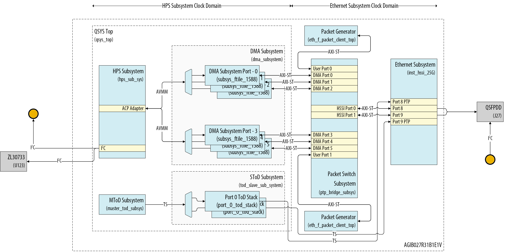

# Agilex&trade; 7 Multi-Channel 25GbE Precision Time Protocol System Example Design

## Description

The Multi-Channel 25G Precision Time Protocol System Example Design includes two Ethernet ports with built-in 2-step hardware PTP timestamping capabilities. The integrated Agilex&trade; 7 Hard Processor System (HPS) operates a PTP software stack that complements the hardware-based timestamping functionality.

The System Example Design (SED) provides the necessary drivers and user applications to support the Linux Network stack, the Linux PTP stack, and network Quality of Service (QoS) through the Linux kernel Traffic Control (TC) system.

The system's primary components include:

- Golden Hardware Reference Design (GHRD)
- Reference HPS software including:
  - Arm Trusted Firmware
  - U-Boot
  - Linux Kernel
  - Linux Drivers
  - User Space Applications



## Repository Structure

Directory Structure Used in This Example Design:

``` bash
|--- agi027fc-si-devkit
  |   |--- src
  |   |   |--- hw
  |   |   |--- sw

```

## Project Details

- **Family**: Agilex&trade; 7 I-Series
- **Quartus Version**: 25.1.1
- **Development Kit**: Agilex&trade; I-Series Transceiver-SoC Development Kit (4x F-Tile) ([DK-SI-AGI027FC](https://www.intel.com/content/www/us/en/products/details/fpga/development-kits/agilex/si-agi027.html))
- **Device Part**: AGIB027R31B1E1VB

## Getting Started

Building the design is easy with the scripts provided in the repo. Clone the repository to get the source files

``` bash
git clone https://github.com/altera-fpga/agilex7-ed-ptp-mcqos-25g.git
cd agilex7-ed-ptp-mcqos-25g
git checkout SED-2x25GE-agilex7_dk_si_agi027fc-Q25.1.1-Rel-1.1
```

Follow the below procedure to build the HW and the Software artifacts.

- [Building the hardware](https://github.com/altera-fpga/agilex7-ed-ptp-mcqos-25g/tree/main/agi027fc-si-devkit/src/hw)
- [Building the software](https://github.com/altera-fpga/agilex7-ed-ptp-mcqos-25g/tree/main/agi027fc-si-devkit/src/sw)